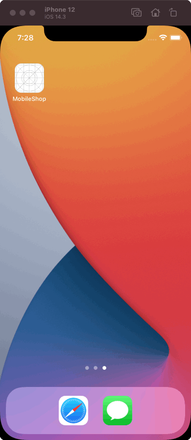

MobileShop is an example iOS application project with a couple of screens representing a simplified shopping experience.

The app includes:
* launch screen
* cart screen
* payment screen

  

The app connects to a remote mock server to pull static cart data. For simplicity's sake, a seemingly successful payment doesn't actually change the state of the cart.

The mock server is created with [My JSON Server](https://my-json-server.typicode.com/) and the data it returns is defined in a [separate repository](https://github.com/srstanic/ios-architecture-mock-api).

This app includes examples of networking, localization, analytics tracking, content loading, error handling, transitions between screens, and alert presentation.

The purpose of this project is to demonstrate the application of high-level principles described in my [iOS architecture whitepaper](https://dev.srdanstanic.com/ios/architecture/2020/10/13/ios-application-architecture-beyond-mvc-mvvm-viper/).
